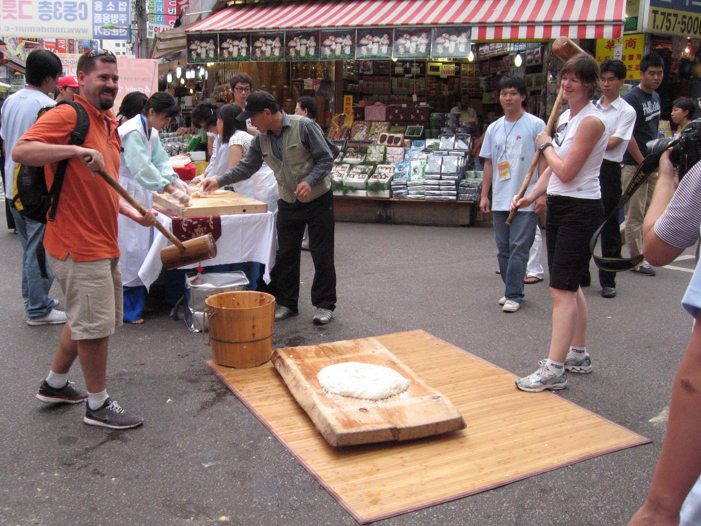
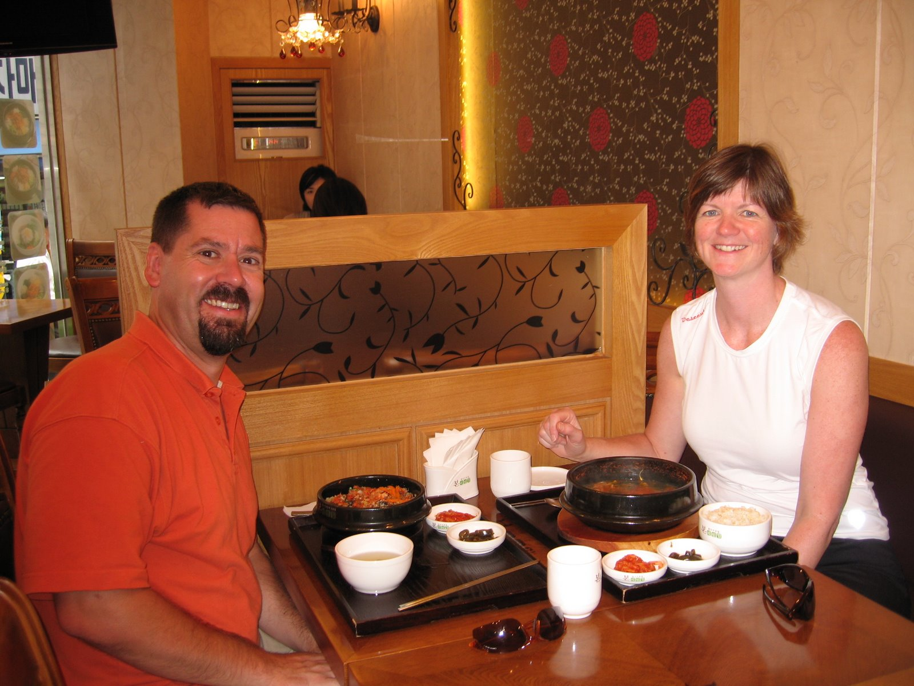
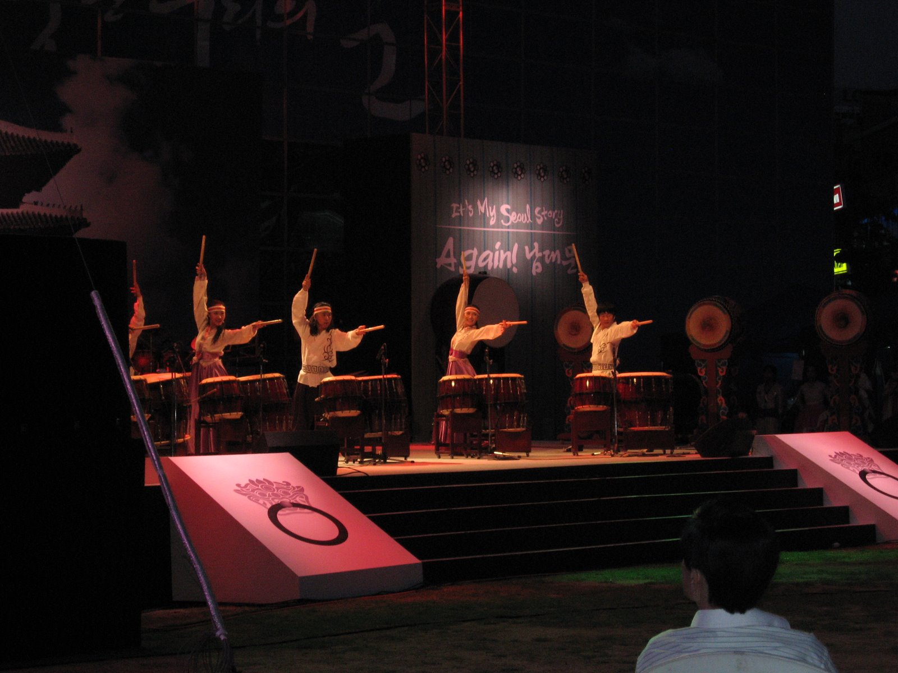
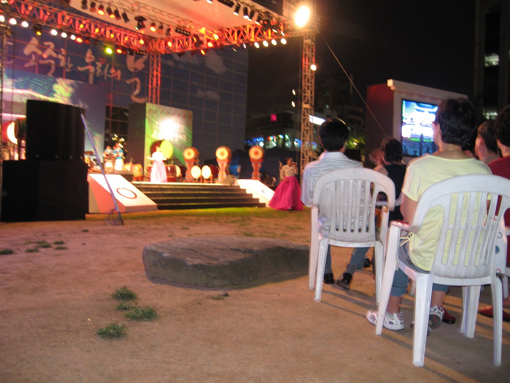

Seoul

This morning we went down to the transit station and on the way had breakfast: a woman had a sandwich cart which she made breakfast sandwiches – we had a grilled western sandwich with ham and cheese and sliced cabbage (I think) – Bruce had the all dressed with mustard, ketchup and a grainy substance that looked like sugar or salt – but we don&#8217;t know what it was.

  
We headed downtown and walked through a market. There is food at small stalls everywhere – we noticed that groups of stalls located beside each other all sold the same items – strange – would have thought that different items would be better for business. We stopped to see a display where a woman was kneading a big mound of dough on a wooden board. There were 2 men with large wooden mallets dipped in water that were pounding on the dough in between kneading. Once one of the men saw us stopped and looking he got us set up with the mallets and had us pounding the dough – all of a sudden there were people taking pictures of us – a couple of them looked like photographers.

There is a lot of traffic and mopeds and motorcycles seem to drive both on the sidewalks and the roads on existent or non-existent lanes. The travel books advice for tourists not to drive is a very good one – the traffic is a it crazy.

We had lunch at a small restaurant (see picture) and then walked around in a few markets and through the streets for the afternoon. We had dinner at an outdoor spot in a market. The food here is very good and there is a lot of seafood -esp. octopus, shellfish, etc.

In the evening we went to a free outdoor show that consisted of drumming, dancing, acrobatics/tumblers, and a short opera (I think).

