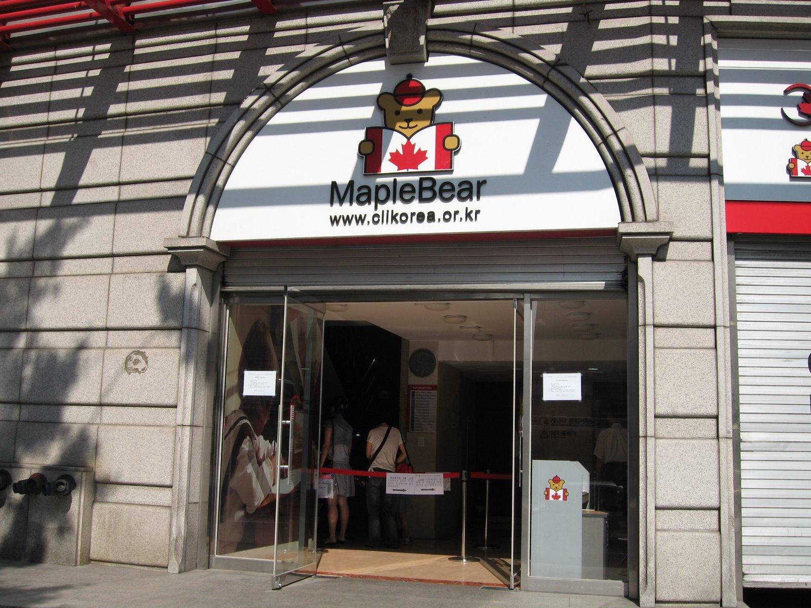
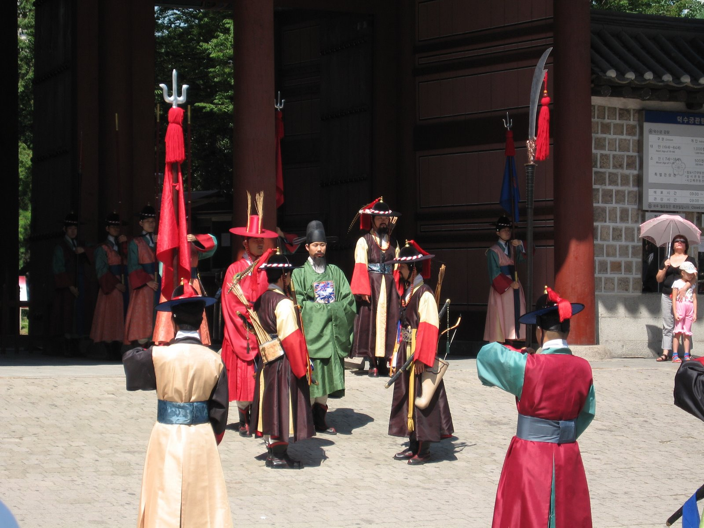
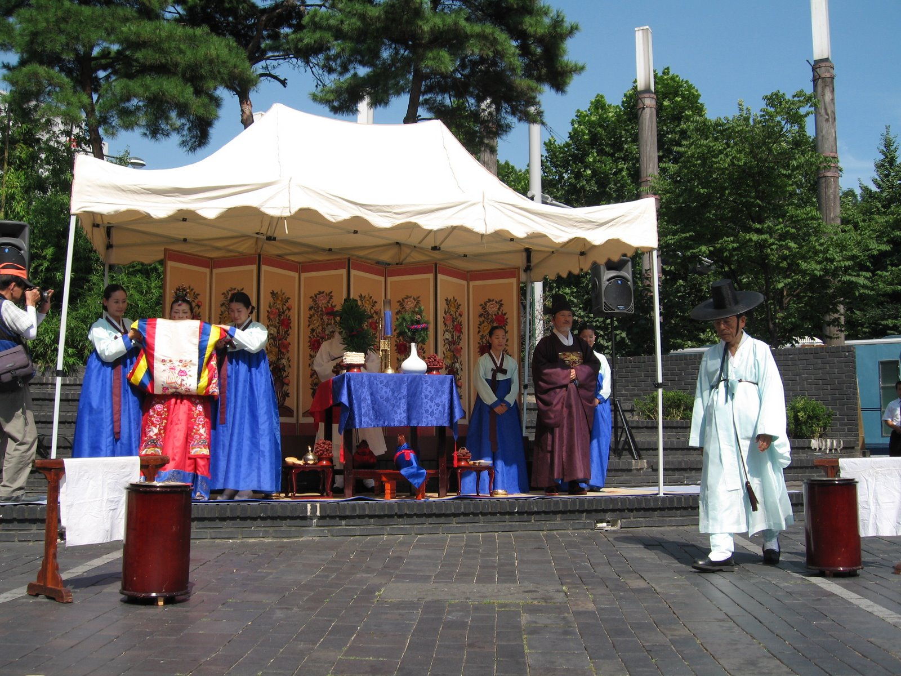
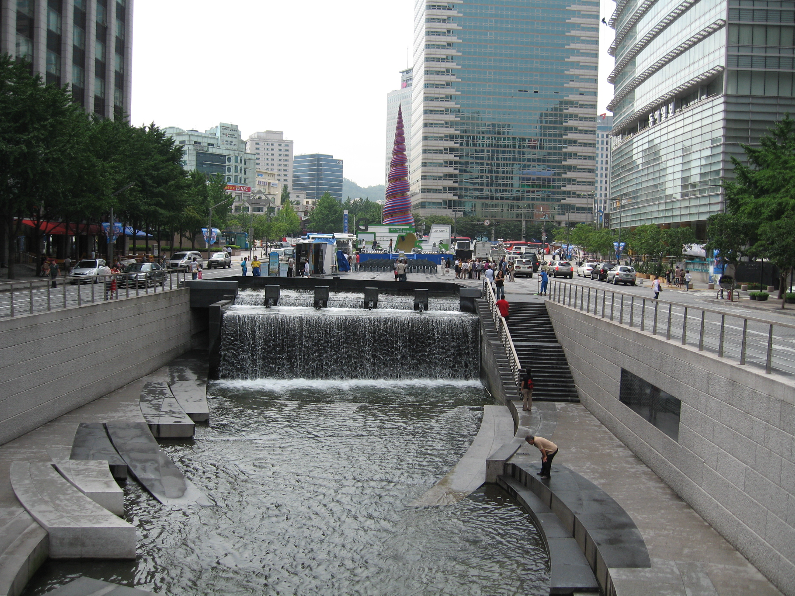

## Seoul

Stopped at the sandwich lady to get breakfast – grilled westerns and then a coffee downtown.

We saw a building with an interesting sign: Maple Bear which had the name of the institution Maple Bear and a teddy bear holding a Canadian Flag. The director was outside and spoke with us – he was from Windsor and explained that Maple Bear was where children attended school to learn English and get exposed to Canada – basically immersion. We went up to see the 3 classrooms that were in progress and noticed that 1 of the teachers was white – possibly someone in Korea to teach English?

[Deoksugung](https://en.wikipedia.org/wiki/Deoksugung): Palace of virtuous longevity across from the Seoul city plaza. We saw the changing of the guards there and had our picture taken with one of the guards. We also had some conversation with a bunch of girls that were probably around 12 years old. They were very excited to be practicing their English and giggled alot. One told me I was pretty and had a small face. They also asked if they were pretty – I told them they were very pretty. We also had a chat with 2 girls in middle school who twirled their hair when they spoke with us – they were also happy to practice their English.

Palace of shining happiness (Gyeongbokgung)– after passing the US embassy which had an unbelievable amount of police protection. Here we got to try on traditional Korean outfits. Bruce was dressed as a high level general. This is very large palace, another changing of the guards show. The throne hall Geunjeongjeon was rebuilt in 1867. 

After Gyeongbokgung we walked through the Insadong district a shopping area of art and antiques. We saw a group of street dancers performers in traditional costumes who were performing down the street. Following that we saw most of a traditional Korean wedding. We were late so just saw the end of the wedding ceremony, then traditional dancers and then drummers with ribbons that were attached to a wire (??) on their hats that they made flow and dance around with movements of their heads, and then the wedding parade – the husband was on a horse and the wife was carried in a seat held up by 4 men.

We wandered down to the Lotte hotel to book our trip to the Demilitarized Zone. Then took a train to Lotte World (Jamsil Station). Lotte World is a &#8216;disney world&#8217; type area. Seoul's version of West Edmonton mall. The mall has an ice rink, shooting range, swimming pool. On the third floor which we couldn&#8217;t go to without paying an admission, we could see a &#8216;mountie&#8217; costume.

We traveled back to [Dongdaemun](https://en.wikipedia.org/wiki/Dongdaemun_District) market area to see a sound and light show. We are never exactly sure where the shows are on (or when) but we found it. It was a music performance that was on Cheonggyecheon stream and area that has been cleaned up and turned into a stream and walkway. Rafts were floated into the stream and the performance was in the center of the stream. We sat on the edge and soaked our feet in the cool water to help cool them down after a long day of walking. From there we grabbed some dinner in what turned out to be a Japanese restaurant. Our first clue should have been the plastic replicas of food displayed outside the restaurant
