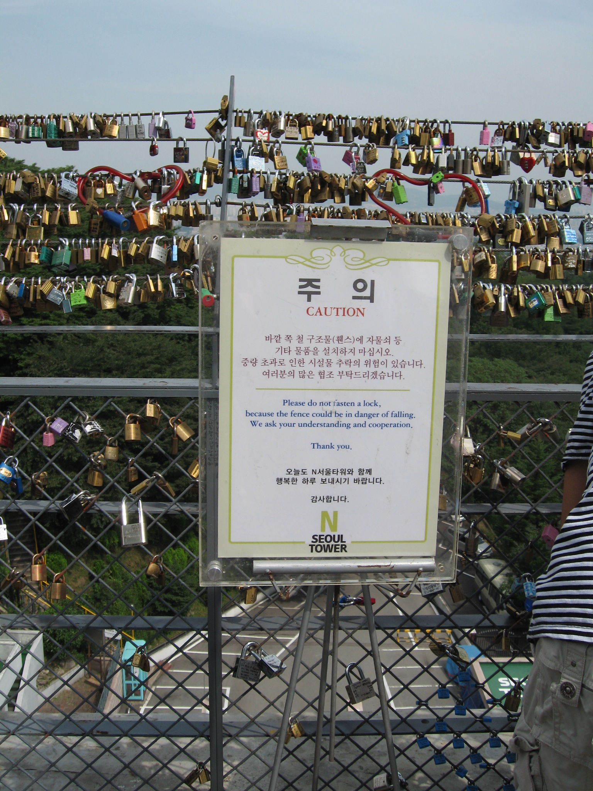
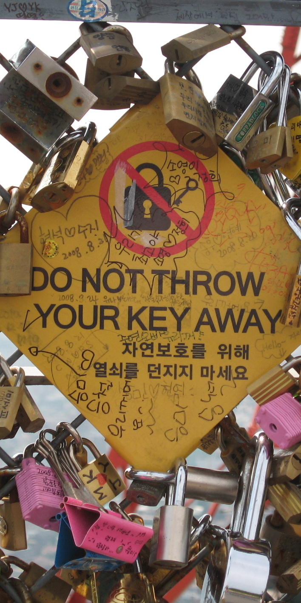
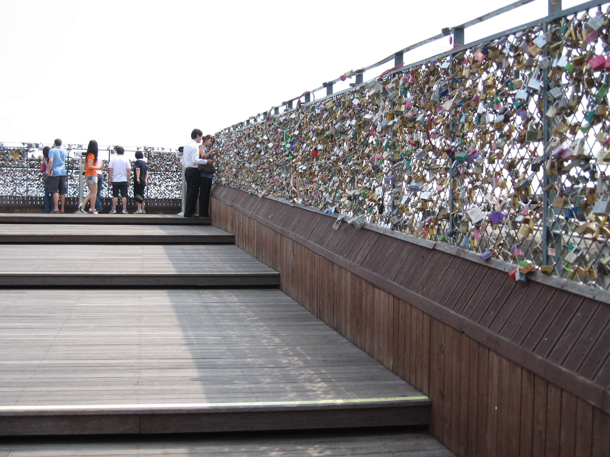
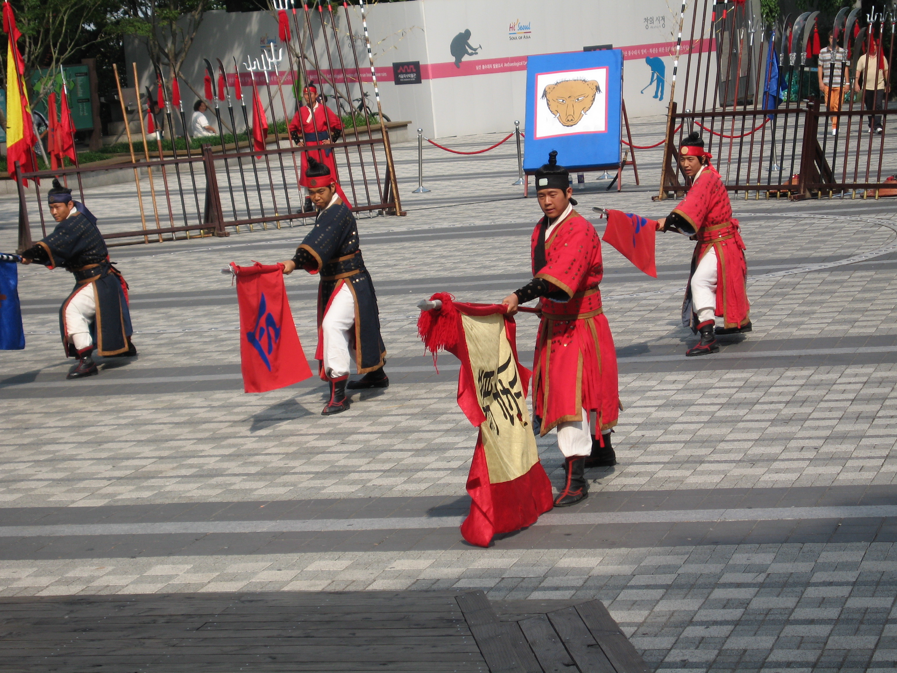

## Seoul

Took it easy this morning as we have had 2-12 hour long tiring days. The sandwich lady is off today – Darlene wandered around and found some huge and yummy muffins, chocolate and coffee milk, and Starbucks cold coffee products at a Crown bakery for breakfast. We have seen Crown Bakery often in Seoul. We also got our laundry done and get some more pictures captioned so we would remember where the pictures were taken.

After laundry was done it was off to Namsam Park and the North Seoul Tower. This is Korea&#8217;s answer to the CN Tower, no where near as tall. It is located on a hill in the park or probably more accurately the hill is the park. There is a cable car that goes most of the way up the hill but that would be too easy. We walked. There are stairs going up the the base of the tower. Lots of Stairs. Lots and Lots of Stairs. It&#8217;s about 30 degrees Celsuis today. I&#8217;m not sure how long it took to get up, but we were pretty drenched at the top. 

We decided not to actually go up the tower. After being up the CN Tower we didn&#8217;t think it was that worth it. What was weird was along the safety rails by the tower there were padlocks. Pairs of padlocks locked to each other then to the rails. In front of the rails was a sign asking people not to lock locks to the rails basically so the rails wouldn&#8217;t fall. Afixed to the rail was another sign &#8211; “Please do not lose your key”. All of the locks had dates on them so we figure it is a sign of love.  

At the tower was a demonstration of 8 martial arts from the 24 martial arts that are described in Muye Dobo Tongji (The Comprehensive Illustrated Manual of the Martial Arts of Ancient Korea) that was published in 1870. (Gotta love google for filling in the information). It was quite an impressive demostration.

After that we decided to go back down to the city. We checked on the cable car, but is was almost as expensive to go down and it is to take it round trip. We walked down. Our legs were trembling at the end of the trip down. 

We arrived in the very commercial shopping district of Myeongdong. This area is full of stores, like the Gap, Club Monoco, Roots, Body Shop. It was absolutely packed. I had a &#8216;pogo&#8217; that was in some kind of seafood batter, it was pretty good. I&#8217;m going to have to try a bacon wrapped hot dog before I come home.

From there was took a subway over to Itaewon. This is area was our least favourite area of Seoul at this point. It felt cheap and trashy. This is also the closest area to a large US Military base (sorry Casey – but I think there is a connection). In this area we saw more non Koreans than we have at any other point in our trip so far. We felt somewhat out of place. We did overhear on person talking about how much she enjoys Shwarma&#8217;s in Ottawa!

After that we decided it was time for dinner – we came back close to the hotel and ended up trying a place called Two Two Fried Chicken. It seems to be a westernized Korean restaurant that has lots of fried chicken. It was the first meal we had where there was no Kimchi – it didn&#8217;t come with pickled radish or daikon.
