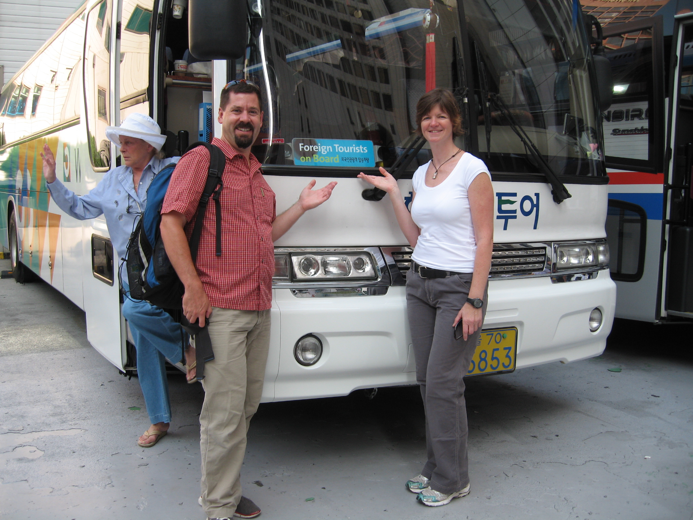
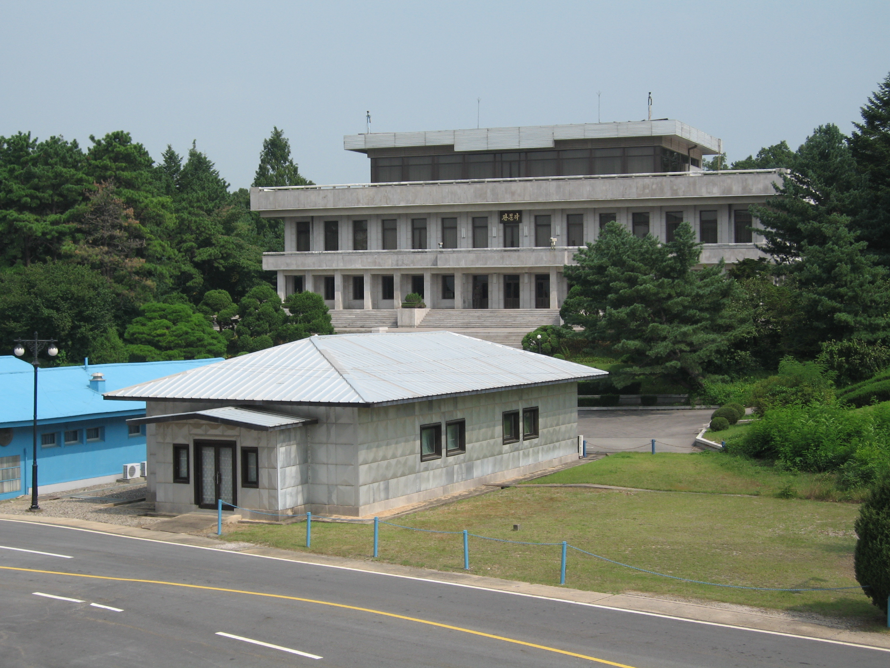
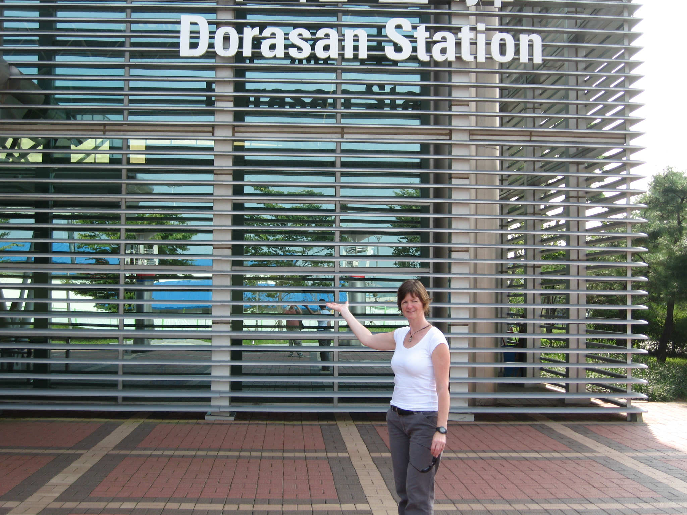

Our first tour in Korea. This is one thing that I didn&#8217;t get to do on my first time through Korea, so it was a must do for this trip. The day starts with a passport check at the tour office and checking to make sure everyone conforms to the dress code (no shorts / sandals / tank tops / nothing that will offend the North Koreans).

Our tour bus had a sign in front “Foreign Tourists on Board”. It takes about an hour to get to our first stop. A checkpoint. A South Korean solider (ROK) soldier comes on board to check our passports and identity. After that checkpoint the bus carries on the Camp Bonifas, home of the United Nations Command Security Battalion. Their motto: In Front of them All. A different solider gets on the bus and does another check of the passports. We are brought into Camp Bonifas for a briefing on do&#8217;s and don&#8217;ts in the Joint Security Area. Basically they don&#8217;t want us to create any international incidents, or get shot. In July 2008 at South Korean tourist was shoot by North Korea after crossing into a restricted area on the east cost of Korea (Not where we were mom!). Taking photos is very restricted.

Once on the formalities are done we change to a JSA bus and proceed to Panmunjom. We left the bus and entered Freedom Hall and proceed through to a small building, the only neutral building in the JSA. When we are in there, there are no North Koreans in the building, but there are microphones that bisect a table in the center of the building and they are apparently listening! The microphones also represent the Military Demarcation Line. On the south side of the microphones you are in South Korea, on the North side you are in North Korea. We got into North Korea for a few moments today!

After this building we move to a pagoda where we can take pictures of the buildings in the JSA and surroundings. The tours is very controlled and you cannot move too far astray. A military escort is with the group constantly. One woman could not go up the pagoda because of a knee problem. An extra solider seem to appear to stand beside her to ensure there was no problem. The English of the security escorts is excellent. Another tourist was asked to remove a camera bag of his pouch – we were supposed to leave any case in the bus – the soldiers English was excellent, with no hint of an accent. Not a place you want to have any misunderstanding.

We get back on the bus and are driving around to a lookout where we can see Propaganda City in North Korea. A city in the DMZ on the North Korea side of the Military Demarcation Line. It has apparently the tallest flag in the world. We had 2 tours guides today. One said the city is uninhabited the other that some North Koreans are starting to live there. South Korea also has a city in the DMZ that is protected by the Soldiers from Camp Bonifas.

Before leaving Camp Bonifas we switch back to our bus, but not before visiting the gift shop. We were hoping for t-shirts for the nephews: Someone when to the DMZ and all I got was a lousy t-shirt. 

In the afternoon we visited the 3rd tunnel of aggression. One of 4 known tunnels that North Korea dug under the DMZ to invade South Korea. The tunnel is 1.6KM long, 73 meters deep and travels 435m past the military demarcation line. It is thought that 30000 soldiers could move through the tunnel in an hour. From our experience, they would be short soldiers. I was hunched over and hit my head countless times (I had a hard hat on).

After the tunnel we when to the Dorasan train station with is the last station before North Korea. It&#8217;s really a symbolic station, without much traffic. But they do have a picture of George W. Bush signing a railway tie. Our tour guide pointed our that if you look closely the marker his is signing with is upside down. 

After the tour we went to the Yongasan Electronics Market, if I had more time and patience for shopping I could probably get a bargain on a new camera, the have a lot. If you need something that plugs into a wall this is the place

Related: [DMZ info on wikipedia](http://en.wikipedia.org/wiki/Korean_Demilitarized_Zone)

 